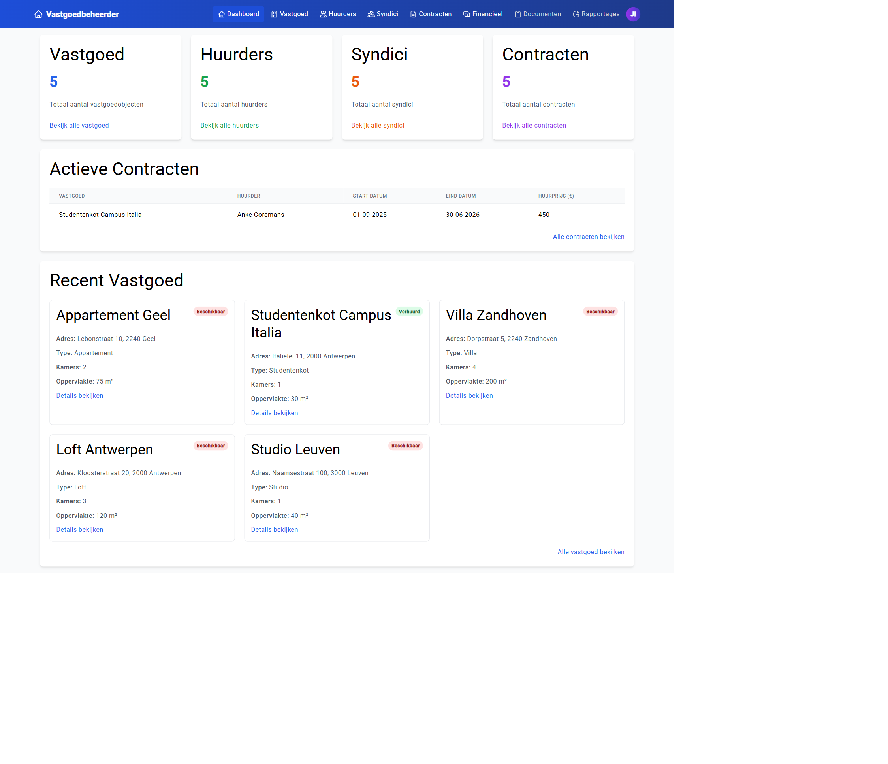
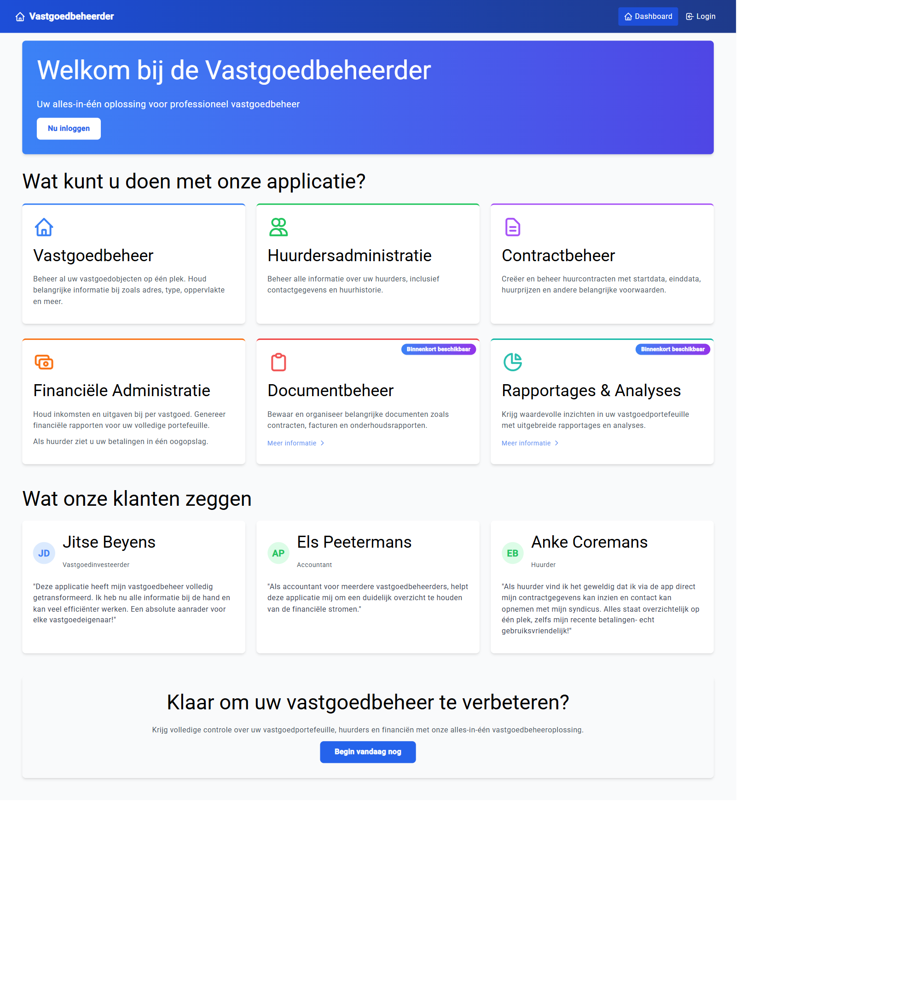
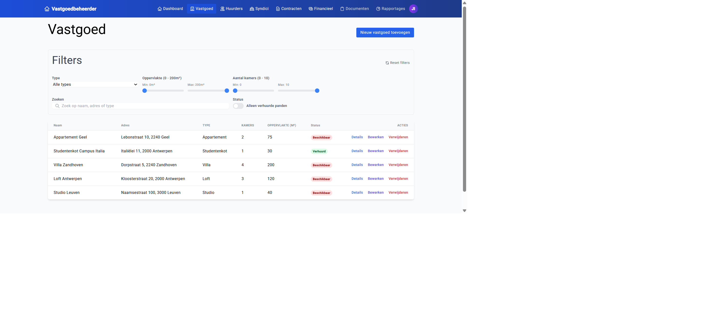
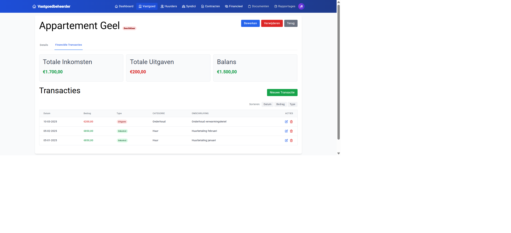

# Vastgoedbeheerder

Een full-stack vastgoedbeheer applicatie met Angular frontend, .NET 8 Web API backend en SQL Server database, volledig gecontaineriseerd met Docker.

> Schoolproject Angular & .NET -- Thomas More Hogeschool (score: 16/20)



## Tech stack

| Laag | Technologie |
|------|-------------|
| Frontend | Angular 18, Tailwind CSS, Auth0 SDK |
| Backend | .NET 8 Web API, Entity Framework Core |
| Database | SQL Server 2022 |
| Auth | Auth0 (JWT, RBAC) |
| Infra | Docker Compose, Nginx, self-signed HTTPS |

## Features

- **Rolgebaseerde toegang** -- 3 rollen (admin, boekhouder, huurder) met eigen dashboard en permissies
- **Vastgoedbeheer** -- CRUD met filters (type, oppervlakte, kamers), zoekbalk en status badges
- **Huurders & syndici** -- registratie, profielbeheer, contactgegevens
- **Contractbeheer** -- koppeling huurder-vastgoed, status tracking (actief/verlopen)
- **Financieel overzicht** -- transacties per pand, inkomsten/uitgaven/balans KPI's
- **Reactive forms** -- FormBuilder met validators voor alle CRUD operaties
- **Template-driven forms** -- NgModel met validatie voor contracten
- **Angular Signals** -- moderne state management voor reactive UI updates
- **Responsive design** -- Tailwind CSS, volledig responsive

## Screenshots

| Landing | Vastgoed overzicht |
|---------|-------------------|
|  |  |

| Dashboard | Financieel |
|-----------|-----------|
|  |  |

## Opstarten

```bash
# Clone en configureer
git clone https://github.com/stijn-portfolio/vastgoedbeheerder.git
cd vastgoedbeheerder
cp .env.example .env    # vul Auth0 credentials in

# Start alles
docker compose up -d
```

Wacht tot SQL Server healthy is (~60s), dan:
- Frontend: https://localhost:4200
- API: https://localhost:7289
- Swagger: https://localhost:7289/swagger

> De browser toont een certificaatwaarschuwing (self-signed). Klik "Advanced" en "Proceed to localhost".

## Projectstructuur

```
vastgoedbeheerder/
  docker-compose.yml
  backend/
    Controllers/          8 REST controllers
    Models/               6 entiteiten (Vastgoed, Huurder, Verhuurder, Contract, Transactie, User)
    DTOs/                 Data transfer objects
    Data/                 DbContext met seed data
    Services/             JWT service
    Migrations/           EF Core migrations
  frontend/
    src/app/
      core/               Auth, services, models, environments
      features/           Dashboard, vastgoed, huurders, syndici, contracten, transacties
      shared/             Nav-bar, toast, confirmation dialog, pipes
```

## Architectuur

- **Auth0 RBAC** -- permissies via JWT claims (`read:vastgoed`, `manage:huurders`, `admin`, etc.)
- **Admin guard** -- route-level beveiliging op basis van Auth0 permissies
- **Seed data** -- 5 panden, 5 huurders, 5 syndici, 5 contracten, 18 transacties
- **Nginx reverse proxy** -- frontend proxied API calls via `/api/` naar de backend container
